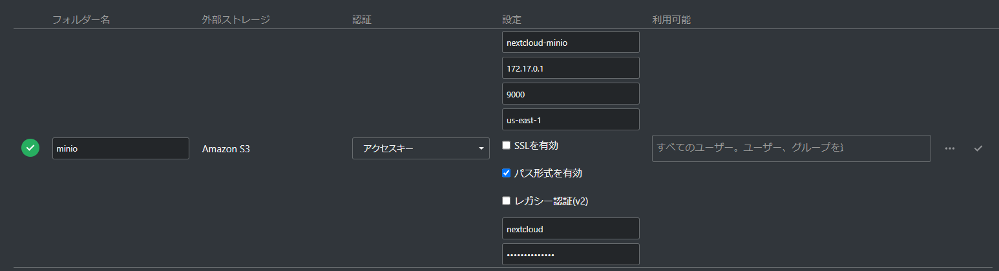

## 概要

nextcloud で学習データ類を管理する考えだったんが、転送スピードは遅いこともあって、minioでデータを管理することにした。

今後、minioをクラウドまたは分散ストレージサーバーに展開しやすいので、minioを採用して進めていく。

## 使用するツール

### minio

awsのs3と類似のapiを使用しているので、s3との連携が可能なツールであれば接続可能。

また処理スピードは分散処理によって高速化可能。

### jupyter lab

機械学習のpythonコード開発時必要なIDEで、ブラウザ上完了するので、IDEのインストールは必要ないことがメリット。

機械学習の初期開発時のツールとして使う。
また、mlflowをの連携は簡単で実験時のデータ確認、比べは可能。


## システム構築時のDocker file

### minio-mlflow-jupyter

```yml:title=docker-compose.yml
version: "3.3"
services:
  s3:
    image:  minio/minio:RELEASE.2021-11-24T23-19-33Z
    restart: unless-stopped
    ports:
      - "9000:9000"
      - "9001:9001"
    environment:
      - MINIO_ROOT_USER=${AWS_ACCESS_KEY_ID}
      - MINIO_ROOT_PASSWORD=${AWS_SECRET_ACCESS_KEY}
    command: server /data --console-address ":9001"
    networks:
      - internal
      - public
    volumes:
      - minio_volume:/data
  db:
    image: mysql/mysql-server:5.7.28
    restart: unless-stopped
    container_name: mlflow_db
    expose:
      - "3306"
    environment:
      - MYSQL_DATABASE=${MYSQL_DATABASE}
      - MYSQL_USER=${MYSQL_USER}
      - MYSQL_PASSWORD=${MYSQL_PASSWORD}
      - MYSQL_ROOT_PASSWORD=${MYSQL_ROOT_PASSWORD}
    volumes:
      - db_volume:/var/lib/mysql
    networks:
      - internal
  mlflow:
    container_name: tracker_mlflow
    image: tracker_ml
    restart: unless-stopped
    build:
      context: ./mlflow
      dockerfile: Dockerfile
    ports:
      - "5000:5000"
    environment:
      - AWS_ACCESS_KEY_ID=${AWS_ACCESS_KEY_ID}
      - AWS_SECRET_ACCESS_KEY=${AWS_SECRET_ACCESS_KEY}
      - AWS_DEFAULT_REGION=${AWS_REGION}
      - MLFLOW_S3_ENDPOINT_URL=http://s3:9000
    networks:
      - public
      - internal
    entrypoint: bash ./wait-for-it.sh db:3306 -t 90 -- mlflow server --backend-store-uri mysql+pymysql://${MYSQL_USER}:${MYSQL_PASSWORD}@db:3306/${MYSQL_DATABASE} --default-artifact-root s3://${AWS_BUCKET_NAME}/ -h 0.0.0.0
  create_s3_buckets:
    image: minio/mc
    depends_on:
      - "s3"
    entrypoint: >
      /bin/sh -c "
      until (/usr/bin/mc alias set minio http://s3:9000 '${AWS_ACCESS_KEY_ID}' '${AWS_SECRET_ACCESS_KEY}') do echo '...waiting...' && sleep 1; done;
      /usr/bin/mc mb minio/mlflow;
      exit 0;
      "
    networks:
      - internal

  jupyterlab:
    depends_on:
      - "s3"
    restart: always
    image: umids/jupyterlab
    container_name: jupyterlab
    working_dir: /home/${NB_USER}
    user: root
    ports:
      - "${JUPYTER_PORT}:8888"
    volumes:
      - ./notebooks:/home/${NB_USER}
    networks:
      - public
      - internal
    environment:
      - NB_USER=${NB_USER}
      - CHOWN_HOME=yes
      - JUPYTER_ENABLE_LAB=yes
      - JUPYTERLAB_S3_ENDPOINT=http://s3:9000
      - JUPYTERLAB_S3_ACCESS_KEY_ID=${AWS_ACCESS_KEY_ID}
      - JUPYTERLAB_S3_SECRET_ACCESS_KEY=${AWS_SECRET_ACCESS_KEY}
      - JUPYTER_TOKEN=${JUPYTER_TOKEN}
      - AWS_ACCESS_KEY_ID=${AWS_ACCESS_KEY_ID}
      - AWS_SECRET_ACCESS_KEY=${AWS_SECRET_ACCESS_KEY}
      - AWS_DEFAULT_REGION=${AWS_REGION}
      - MLFLOW_S3_ENDPOINT_URL=http://s3:9000
networks:
  internal:
  public:
volumes:
  db_volume:
  minio_volume:
```

```txt:title=.env
AWS_ACCESS_KEY_ID=admin
AWS_SECRET_ACCESS_KEY=sample_key
AWS_REGION=us-east-1
AWS_BUCKET_NAME=mlflow
MYSQL_DATABASE=mlflow
MYSQL_USER=mlflow_user
MYSQL_PASSWORD=mlflow_password
MYSQL_ROOT_PASSWORD=toor
MLFLOW_S3_ENDPOINT_URL=http://localhost:9000
MLFLOW_TRACKING_URI=http://localhost:5000
# jupyter configuration
JUPYTER_PORT=8888
NB_USER=root
JUPYTER_TOKEN=neely
```
### nextcloud-minio


```yml:title=docker-compose.yml
version: '2'

volumes:
  nextcloud:
  db:

services:
  db:
    image: mariadb
    restart: always
    command: --transaction-isolation=READ-COMMITTED --binlog-format=ROW
    volumes:
      - db:/var/lib/mysql
    environment:
      - MYSQL_ROOT_PASSWORD=root
      - MYSQL_PASSWORD=root
      - MYSQL_DATABASE=nextcloud
      - MYSQL_USER=nextcloud

  app:
    image: nextcloud
    restart: always
    ports:
      - 8090:80
    links:
      - db
    volumes:
      - nextcloud:/var/www/html
    environment:
      - MYSQL_PASSWORD=root
      - MYSQL_DATABASE=nextcloud
      - MYSQL_USER=nextcloud
      - MYSQL_HOST=db

```

```txt:title=.env
ENV_MYSQL_ROOT_PASSWORD=root
ENV_MYSQL_PASSWORD=root
```

```php:title=/var/www/html/config/config.php
  'objectstore' => array(
    'class' => 'OC\\Files\\ObjectStore\\S3',
    'arguments' => array(
            'bucket' => 'nextcloud',
            'autocreate' => true,
            'region' => 'optional',
            'key'    => 'nextcloud',
            'secret' => 'nextcloud',
            'hostname' => '172.17.0.1',
            'port' => 9000,
            'use_ssl' => false,
            'use_path_style'=> false,
    ),
),
```

`hostname`については、minioのdockerコンテナーのアドレス番号（Gateway）にしてください。`localhost`だと通信できなかった。
コンテナーのアドレスは`docker inspect コンテナー番号`で調べてください。

また、nextcloudでの外部ストレージ設定でminioを接続可能。



ただし、minio側でデータを更新した場合、nextcloud側で即時に表示できないバッグがある。
webdavで作成した共有フォルダを一度開くと、nextcloud UI側反映できるようになるが、根本対策は不明。
