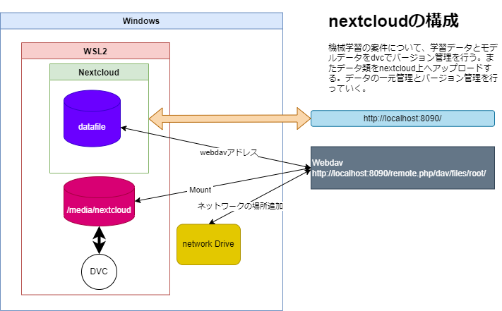

## 概要

機械学習の案件の場合、学習データと学習モデルの管理を行う必要がある。
理由としては、学習データの場合、データの被覆性と均一性などデータの性質を保つため、どのような学習データを使用していたかその正確性を確認できるために、バージョン管理のような仕組みが欠かせない。

学習モデルについては、実機にリリースしたものはどれなのかを追跡するためにバージョン管理していく必要がある。

## 使用するツール

### DVC

data version controlのこと。Gitに類似する形で学習データ類のようなバイナリーデータを管理していく。

Gitを使用しない理由としては、バイナリーデータに不向きのため。

### nextcloud

データの一元管理については、クラウドデータストレージのほうが望ましいが、社内インフラを整うのは手間。その代わりに、nextcloudというオンプレミスのデータサーバーを利用することにした。nextcloudの場合webdavでリモートアクセスすることが便利。また、ウェブベースの画面でのデータの確認も可能。学習結果のデータを確認するツールとしても有用だと感じた。

### システムの構成案

