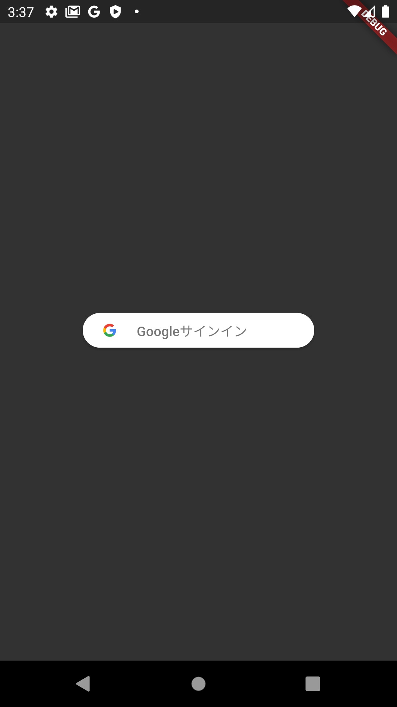

```toc
# This code block gets replaced with the TOC
```

## なんでスマホアプリを作るか

ウェブサイトを作って公開しているが、膨大のウェブサイト中で認知されるまではすごく時間かかるし、ウェブサイトにアドレスを打ち込んで開くのも手間がかかる課題を感じた。

スマホアプリの方が、アイコンクリックしたら開けることや業務でもスマホを使っていて全社展開する話もあるので、ステップアップに役に立つと考えた。

なによりも、スマホアプリを作り始めると楽しい。ウェブサイトを異なって、限られたサイズの中にいかに工夫して、ナビゲーションやアニメーションはより重視し、デザイン性も求められている。面白いものをつくれたらなというモチベーションが沸いてくる。

## Flutterを選択した理由

マルチプラットフォームと実行スピードの優位性で選んだ。React Nativeも考えたが、実行時のスピードが遅く、業務に使おうとしたら不利だと感じて、選んでなかった。

## 途中の画面のイメージ




