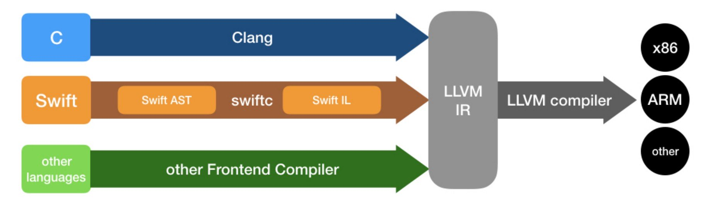

## C言語について

最近仕事で、レガシーのC言語コードをメンテナンスすることになって、C言語のコンパイル環境やCI環境などを構築した。

コンパイル自体はライブラリ提供会社からのツールがあったが、CIを実装する際に、バッチファイルでMakefileをたたき、Azure devops pipelineで実行できるようになっている。

## Compiler Explorer

Windowsの環境下でGCCの環境構築するには、CgwinかMingwなどをインストールする必要がある。

代わりに、ツールをLinuxマシンサーバーサイドでインストールし、ブラウザ上コンパイルして結果確認するツールとしてCompiler Explorerがある。

実際では、WSLの中に、Compiler Explorerをインストールし、またdotnetコンパイラをインストールして、ブラウザ上dotnet（Visual Basic）とGCCの動作を確認した。

また、Compiler Explorerのコード画面をiframeでほかのサイトへembedできるので、すぐ動作チェック可能なサンプルコードサイトの作成ができ、教育リソースとしてもよい。

## LLVM

最新のホットのCの話題として、LLVMがある。主にAppleのアプリ開発でスピード向上のために、LLVMの最適化インフラを取り入れたのは始まりだそうで。最新のSwiftやRustなどへ適応でき、とくにSwiftとLLVMの開発者は同じであって、Appleの動作が早いアプリやOSを支える開発ツールといえる。

コンパイラの場合、フロントエンドとバックエンドの言葉もあって、なんだかWeb開発と同じである。
フロンドエンドとバックエンドのつなぎとしてLLVM のIRといった中間言語があるとの状態。ちなみにWeb開発の場合、つなぎ役としてRestApiが基本。

LLVM自体を理解するではないが、それを使って同じコード例えばCでコンパイルして生成された実行ファイルの実行スピードの向上や使用メモリの削減へ貢献できるので、やらないと損するような感じ。

LLVMの登場にはGCCの進化の停滞が起因の一つであって、確立された技術はどんどん遅くなって（最新の技術や考え方を取り入れることとそれを入れようとした場合スピードが遅くなる）、いつか身動きがとれなくなった。

それを打破するには一部を壊して、作り直すのは一番の解決策であり、LLVMの場合見事に成功しているといえる。Appleの開発を支える技術になり、iOSやSwiftを支えてきたから。
