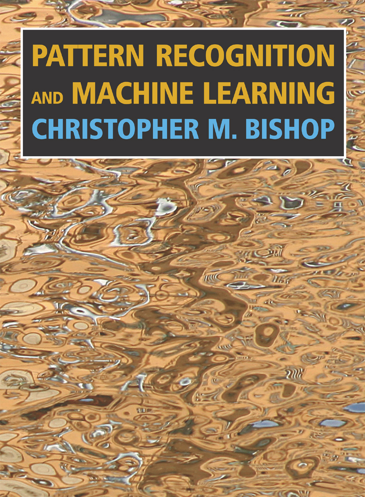
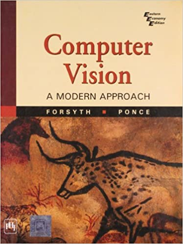

```toc
# This code block gets replaced with the TOC
```

## Image Processing

学生時代では画像処理の研究をした。

画像処理は画素単位の処理から、エッジ抽出(Canny edge detection)、Affine 変換などは基本。数学は必要が、Matrix演算は中心の印象。

[OpenCV](https://opencv.org/)では主な画像処理の関数が実装されている。


## Machine Learning

大学院入学した後、機械学習(Machine Learning)に興味があって、
英文の教科書(8000円?)を買って独学した。



機械学習では統計学のモデル(Likelihood estimation,Baysian statistics)は中心で数式ばかり。
数学には自信がなければ、続けれない分野だと思う。

私が院生の時、BaysianモデルとSupport Vector Machineがはやっていたが、現在ではNeural NetworkであるDeepLearningが盛んで、圧倒的なモデルになっている感じ。

## Computer Vision

画像処理と機械学習の融合としては、Computer Visionという学問がある。
[CVPR](https://en.wikipedia.org/wiki/Conference_on_Computer_Vision_and_Pattern_Recognition)や[ICCV](https://en.wikipedia.org/wiki/International_Conference_on_Computer_Vision)はIEEEのトップConferenceはComputer Visonの関連。

学生の時、下記本を参考して勉強したが、難しかった。



今でもComputer Visionは非常に注目されている分野。直近では企業もこの分野へ参入して注力している印象。

## Machine Vision

画像処理を製造業への応用として、Machine Visonがある。
特に寸法計測と外観検査などを装置として作り上げること。

私の仕事はMachine Vision関係で、
装置化時重視される処理時間を強化された[商業用の画像処理ライブラリ](https://www.mvtec.com/products/halcon)を使うことがよくある。

Machine Visionは今までではそれほど高度の処理がいらなく、２値化や領域処理で物足りるが、
最近では曖昧な外観検査を対処するために、機械学習のモデル(SVM,CNN)を利用できるライブラリも充実してきた。

## まとめ

各分野で共通しているのは数学の知識が最重要であること。行列演算はもちろん、幾何学の知識または数論(Group theory)も必要になる。

数学が好きまたは得意な人は挑戦してみるのは。最先端の分野であるから。