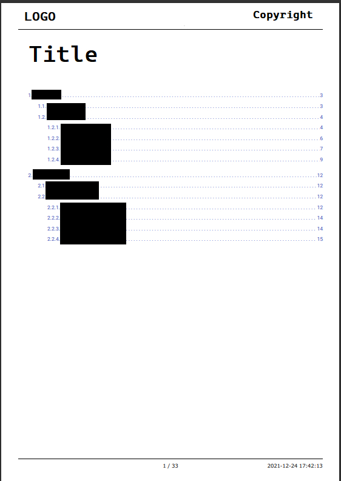

```toc
# This code block gets replaced with the TOC
```

## Pdf文書の必要性

ウェブページで作成した取説について、関係者へ配布するときに、印刷またはオフラインで確認しやすいように、Pdfのようなフォーマットは望ましい。

## 生成したPdfの例

生成したPdfの１ページ目の例。

特徴は、目次（Table of Contents）の部分も自動生成させて、長い文書の内容が一目瞭然になっていること。



## Pdf自動生成の流れ

1. [Express](https://expressjs.com/ja/)のルーティングによってPdf生成時のサーバサイドの関数を呼び出す
1. [puppeteer](https://github.com/puppeteer/puppeteer)を使って中間Pdfを生成する
1. [pdf-parse](https://www.npmjs.com/package/pdf-parse)を使って生成したPdfを解析し、目次に当たる内容とそのページ番号を抽出する
1. バッファーのhtmlのTOC部にページ番号を追記する
1. バッファーのhtmlに対して、最終のPdfを生成する

## Expressのルーティング

各ウェブサイトのurlに`/Pdf/`をつけたことで、`ssr.js`が呼び出され、Pdfを生成する。そして、クライアントサイドにPdf文書としてダウンロードされる。

```javascript:title=server.js {numberLines: 12}
app.get(/Pdf/, async (req, res, next) => {
  var oriUrl = req.originalUrl;
  oriUrl = oriUrl.replace("Pdf", "");
  const { Pdf, ttRenderMs } = await ssr(
    `${req.protocol}://${req.get("host")}${oriUrl}`
  );
  res.set(
    "Server-Timing",
    `Prerender;dur=${ttRenderMs};desc="Headless render time (ms)"`
  );
  console.log(oriUrl);
  var PdfTitle = oriUrl.replace(/\//g, " ").trim().replace(/ /g, "-");
  console.log(PdfTitle);
  res.setHeader("content-type", "application/Pdf");
  res.setHeader("content-Disposition", `attachment;filename=${PdfTitle}.Pdf`);
  return res.status(200).send(Pdf); // Serve prerendered page as response.
});
```

## Pdf生成

### 共通のHeaderとFooter

`headerTemplate`の`src`に、ロゴの画像のRawデータを入れることで、ロゴが各Pdfのページの左上に印刷される。

```javascript:title=ssr.js {numberLines: 16}
  const currentDatatime = new Date().toLocaleString({ timeZone: "Asia/Tokyo" });

  headerTemplate = `<div style="position: relative; top: 0px; left: 0px; width: 100%; border-bottom: 1px solid black; margin: -5px 30px 0px; padding: 0px 0px 1px; font-size: 9px; font-family: Meiryo, Arial, sans-serif;">
<div style="top: 0px; left: 0px; width: 200px; height: 35px; margin: 0px; padding: 0px">
<image height="30px" src="data:image/png;base64,....." />
</div><div style="position: absolute; top: 20px;right: 0px;text-align: right; margin: 0px; padding: 0px;">Copyright &copy;  CO.,LTD.</div>
</div>`;

  footerTemplate = `<div style="position: relative; width: 100%; border-top: 1px solid black; margin: 0px 30px 25px; padding: 1px, 0px, 0px; font-size: 9px; font-family: Meiryo, Arial, sans-serif;">
  <div style="position: absolute; top: 5px; left: 0px; text-align: left;">
  <span class="title"></span></div>
  <div style="position: absolute; top: 5px; width: 100%; text-align: center;">
  <span class="pageNumber"></span> / <span class="totalPages"></span></div>
  <div style="position: absolute; top: 5px; right: 0px; text-align: right;">${currentDatatime}</div></div>`;
```

### Pdf作成

`executablePath`は実際のHeadless Chromeのexeのパスに書き換えてください。

```javascript:title=ssr.js {numberLines: 81}
  const browser = await puppeteer.launch({
    executablePath:
      "./node_modules/puppeteer/.local-chromium/win32-555668/chrome-win32/chrome.exe",
  });
  const page = await browser.newPage();

  const PdfInter = await page.Pdf({
    format: "A4",
    displayHeaderFooter: true,
    headerTemplate: headerTemplate, // indicate html template for header
    footerTemplate: footerTemplate, // indicate html template for header
    margin: {
      // increase margins (in this example, required!)
      top: 80,
      bottom: 80,
      left: 30,
      right: 30,
    },
  });
```

## 目次部分のCSS

目次の部分については、`ul>li`の構造で、Leaderを追加するために、CSSの中で下記のように記述すること。

```css:title=print.css {numberLines: 1}
@media print {
    ul li {
        position:relative
    }
    ul li .toc-page-number {
        float:right
    }
    ul li{
        padding: 0;
        overflow-x: hidden;
        margin:0 0 24pt;
        list-style: none;
        list-style-type:none;
    }
    ul li,
    ul li a,
    .toc-page-number{
        background:white;
    }
    ul li a:before {
        float:left;
        width:0;
        white-space:nowrap;
        content:
    ". . . . . . . . . . . . . . . . . . . . "
    ". . . . . . . . . . . . . . . . . . . . "
    ". . . . . . . . . . . . . . . . . . . . "
    ". . . . . . . . . . . . . . . . . . . . "
    ". . . . . . . . . . . . . . . . . . . . ";
    }
}
```

## Pdfのパーサー

Pdf文書の中に、TOCの各項目に当たる文字列を抽出して、`tocFilterdArray`の中に格納する。そして、各ページに当文字列があった場合、そのページの番号を`pageNumbers`に格納する。

最後に、htmlのTOCの部分のページ番号に当たる箇所に、Pdfの解析結果`pageNumbers`を挿入する。

```javascript:title=ssr.js {numberLines: 105}
  var Pdf2 = require("pdf-parse");

  await Pdf2(PdfInter)
    .then(function (data) {
      var text = data.text;
      var stringArray = text.split("\n");
      var tocFilterdArray = [];
      for (const elem of stringArray) {
        if (elem.startsWith(". . . . . . . . .") === true) {
          var tempStr = elem.replace(/^([. ]*)/g, "");
          tempStr = tempStr.replace(/([. ]*)$/g, "");
          tocFilterdArray.push(tempStr);
        }
      }

      var filterdArray = [];
      var currentPage = 1;
      for (const elem of stringArray) {
        if (elem.endsWith(currentDatatime) === true) {
          if (elem.startsWith(pagetitle) === true) {
            var tempStr = elem
              .replace(currentDatatime, "")
              .replace(pagetitle, "");
            var temparr = tempStr.split("/");
            currentPage = temparr[0].trim();
            filterdArray.push(currentPage);
            console.log("Push: " + currentPage);
          }
        }
        if (tocFilterdArray.includes(elem) === true) {
          filterdArray.push(elem);
          pageNumbers.push(parseInt(currentPage));
        }
      }
      const tocEl = root.querySelectorAll(".toc-page-number");
      let pageNumberCorrect = 0;
      tocEl.forEach((element) => {
        const tempValue = pageNumbers[pageNumberCorrect];
        element.set_content(String(tempValue));
        pageNumberCorrect = pageNumberCorrect + 1;
      });
    })
    .catch(function (err) {
      console.log(err);
    });
```

上記最終に生成されたhtmlを再度puppeteerを使ってPdfを生成させることで、目次付きのPdfの作成が可能。

## まとめ

Headless chrome puppeteerを使うことで、pdf文書を簡単に生成できる。また、生成したPdfの文書をメモリ上で解析することで、目次に必要なページ番号を抽出可能。抽出したページ番号をhtmlに挿入し、Pdfを再作成すると、目次付きの文書が作れる。

この事例を通じて、サーバーサイドでPdfデータまたhtmlデータを解析また操作する方法を覚えていただき、是非活用してください。